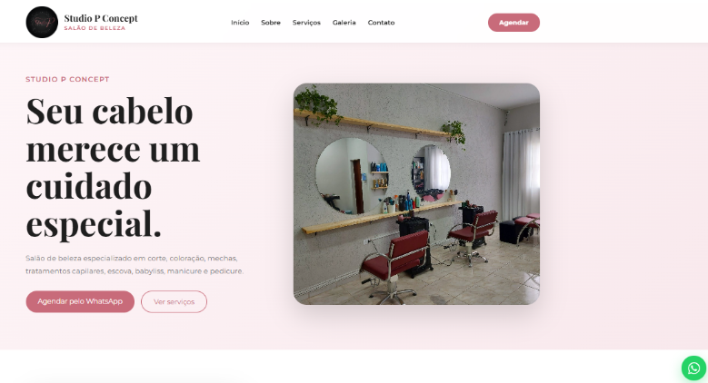

# 💇‍♀️ Studio P Concept

Site institucional desenvolvido para o salão de beleza Studio P Concept, com foco em elegância, responsividade e experiência do usuário.

## ✨ Sobre o projeto

O Studio P Concept é um salão especializado em:

- Corte feminino
- Coloração
- Mechas
- Tratamentos capilares
- Escova
- Babyliss
- Manicure e pedicure

O objetivo do projeto foi criar uma presença digital moderna, transmitindo sofisticação, confiança e profissionalismo.

---

## 🚀 Tecnologias utilizadas

- React
- Vite
- JavaScript
- CSS3
- HTML5
- React Icons

---

## 📱 Responsividade

O site foi desenvolvido para funcionar em:

✅ Desktop

✅ Notebook

✅ Tablet

✅ Smartphones

---

## 🎨 Design

O visual foi construído utilizando uma identidade elegante e feminina:

- Rosa sofisticado
- Branco
- Tons neutros
- Tipografia premium (Playfair Display + Montserrat)

---

## 📸 Funcionalidades

- Menu de navegação
- Seção sobre o salão
- Apresentação dos serviços
- Galeria de trabalhos
- Marcas profissionais utilizadas
- Contato
- Botão flutuante do WhatsApp
- Layout responsivo

---

## 🖼️ Preview do Projeto



---

## 📂 Como executar o projeto

Clone o repositório:

```bash
git clone https://github.com/seuusuario/studio-p-concept.git
```

Acesse a pasta:

```bash
cd studio-p-concept
```

Instale as dependências:

```bash
npm install
```

Execute:

```bash
npm run dev
```

---

## 👩‍💻 Desenvolvido por

**Paula Bezerra**

Desenvolvedora Front-End.


